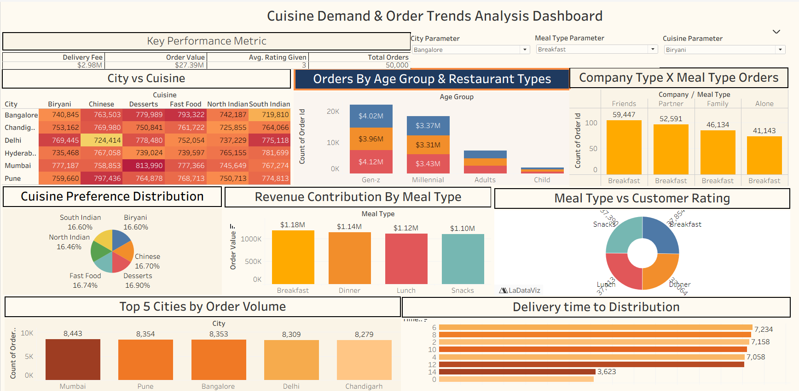
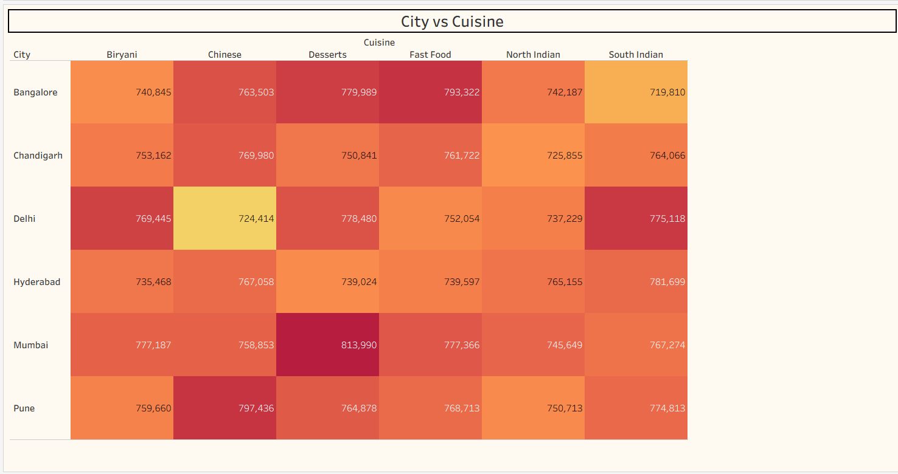
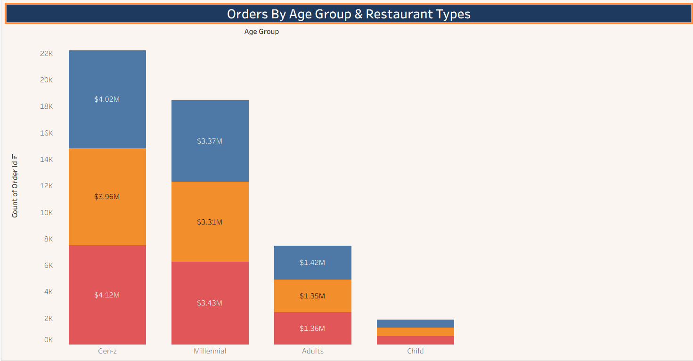
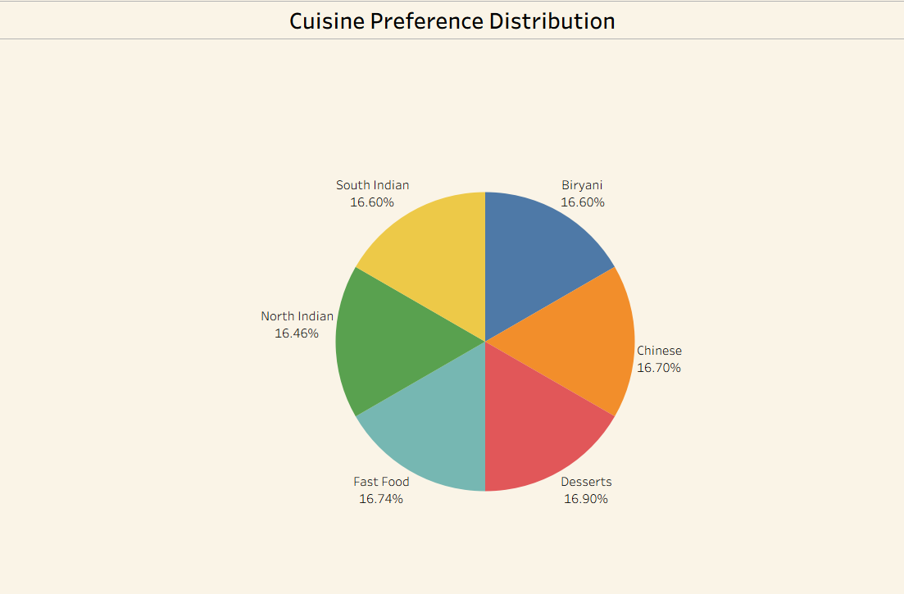
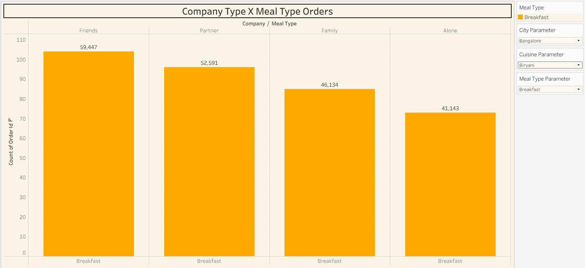
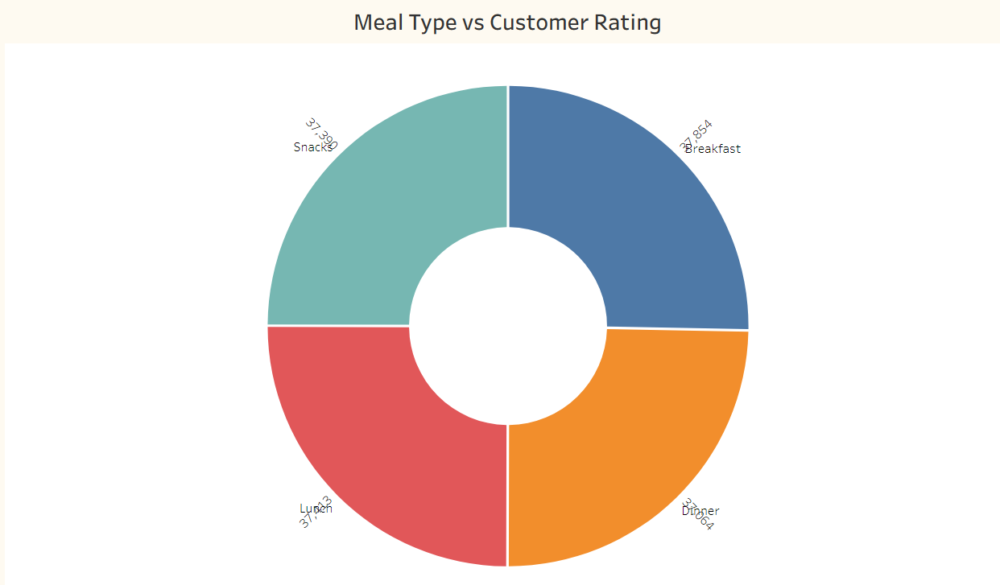
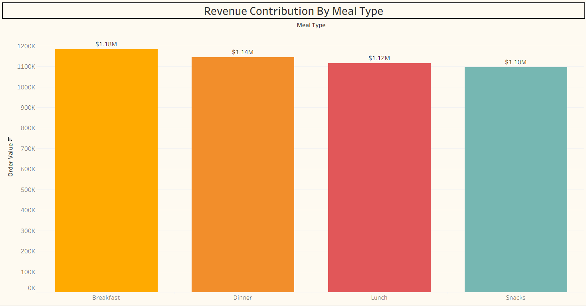
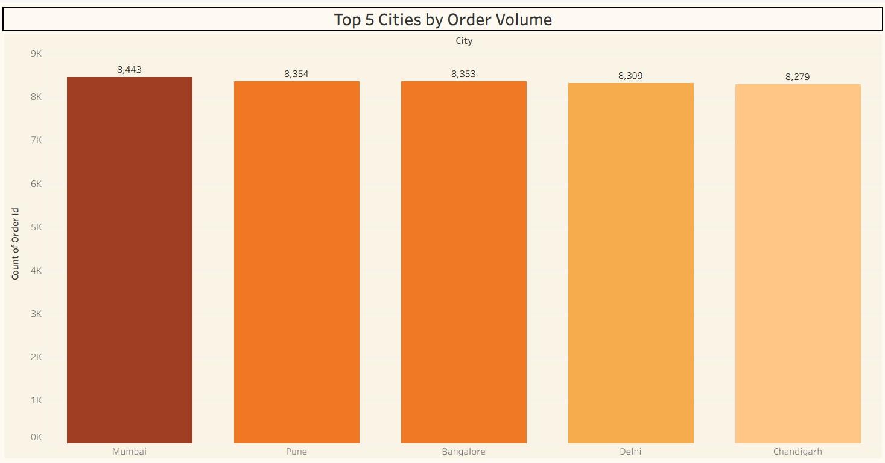
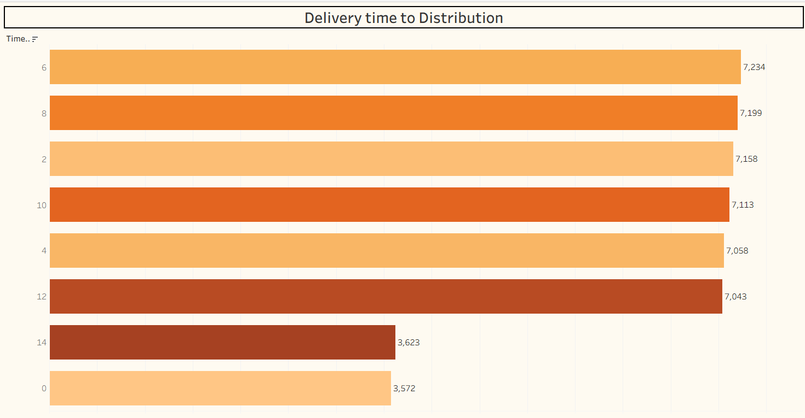

# FOOD ORDERING BEHAVIOUR AND CONSUMER TRENDS DASHBOARD

## Project Overview

This Tableau dashboard was developed to analyze food ordering behaviour and consumer trends through interactive visualizations. It provides business users with insights into customer preferences, revenue contribution, delivery performance, and city-wise order analysis using KPIs, charts, and filters.

## Dashboard KPIs

- Delivery Fee
- Order Value
- Average Rating Given
- Total Orders

## Visualizations

### City vs Cuisine

### Orders By Age Group & Restaurant Types

### Cuisine Preference Distribution

### Company Type By Meal Type

### Meal Type vs Customer Rating

### Revenue Contribution By Meal Type

### Top 5 Cities By Order Volume

### Delivery Time Distribution

## Tools Used

- Tableau Public
- GitHub
- Excel

## Dataset

Food Ordering Behavior Dataset

## Dashboard Preview

## Useful Links

- **GitHub Repository:** [GitHub Repository](https://github.com/Sai-Phani-Krishna8/Food-Ordering-Behaviour-Analysis)
- **Tableau Public Profile:** [View Tableau Public Profile](https://public.tableau.com/app/profile/sai.phani.krishna.tallam/vizzes)
- **Tableau Dashboard:** [View Dashboard](https://public.tableau.com/app/profile/sai.phani.krishna.tallam/viz/FoodOrderingBehaviourDashBoard/Dashboard1)
- **Tableau Story:** [View Story](https://public.tableau.com/app/profile/sai.phani.krishna.tallam/viz/FoodOrderingBehaviourStory/Story1)
- **Demo Video:** [View Video](https://drive.google.com/file/d/19xJ6FbsYww2ncSfbhqe_VmtpzLkiPdGe/view?usp=sharing)

## Author

- Sai Phani Krishna Tallam
